# PuerTS及相关框架使用指南

## 前言

### 选型
脚本技术选型是排除法来定的，这里统计一下脚本接入方案（截至2026/01/17）

* Lua一族（xLua,UnLua）：应该是最常用的方案，使用简单，但Lua 是弱类型语言，编写效率低下,重构麻烦，不利于技术/产品迭代；

* C#（UnrealSharp,UnrealCSharp）：C#是最想去使用的方案，因为考虑到很多团队和开发人员是从Unity转UE的（或者反复横跳），使用此方案能减少很多切换成本；可惜当前的开源方案都是玩具级别的，完全没有案例；

* TypeScript：Typescript是强类型语言，对比Lua而言多了编译期类型校验，可以减少很多不必要的语法错误，而且编辑器可以根据类型分析提供大量代码提示，并且C#和TypeScript由同一人操刀，对于C#使用者切换成本较低；可惜的是相关案例比较少，而且TS相关使用人员集中在前端领域；当然，在当前AI时代，TypeScript有着巨大优势，这也是考虑到使用TS的原因之一。

* AngelScript：感觉是简化版的C++,不过AS貌似只用在游戏开发上，对于想~~转行跑路~~扩充技术栈的同学有点不利...

* 其他：


## 部署教程

### 0. 下载Nodejs：https://nodejs.org/en/download/current ，并安装
<a id="install-node"></a>
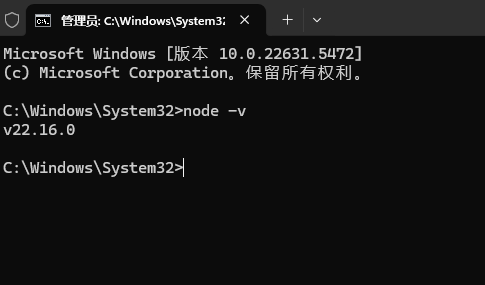
输入
```sh
node -v
```
如果出现版本号提示则安装成功。
### 1. 下载、部署PuerTS：

### 1. 下载部署Puerts
Puerts：https://github.com/Tencent/puerts 

PuerTS辅助插件PuerTSTool:

下载安装到插件目录：
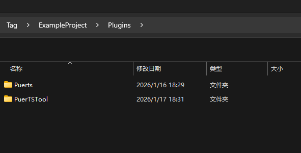

进入到Puerts目录执行
```sh
node enable_puerts_module.js
```


***上面的命令只需要执行一次***(如果不成功则[检查是否安装nodejs](#install-node))，该命令会把Puerts的模块文件拷贝到工程目录相应的位置，具体拷贝了什么可以直接打开node enable_puerts_module.js文件查看。最终会在工程根目录下生成tsconfig.json和Typescript文件夹，***后续的脚本工程都在TypeScript文件夹下面添加***。
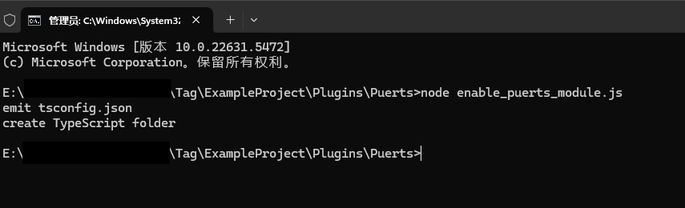
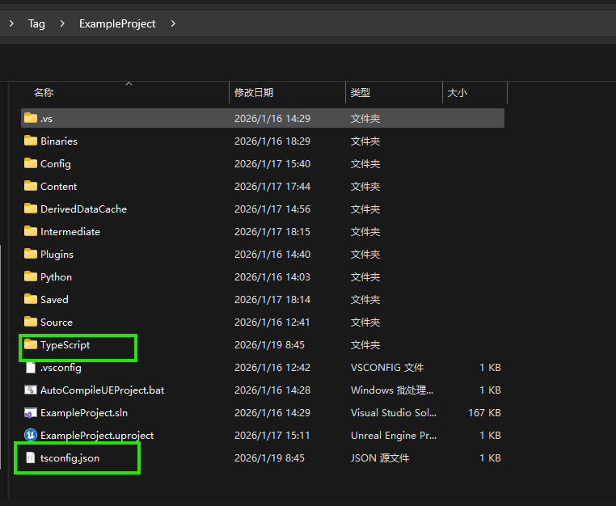


还需要把[V8引擎库](https://github.com/puerts/backend-v8/releases/)（或者quickjs，nodejs但暂未验证）放在 Puerts/ThirdParty/ 下(官方github的release版会自带v8,最好检查一下是否存在),这里以v8的V10_6_194版本做介绍：
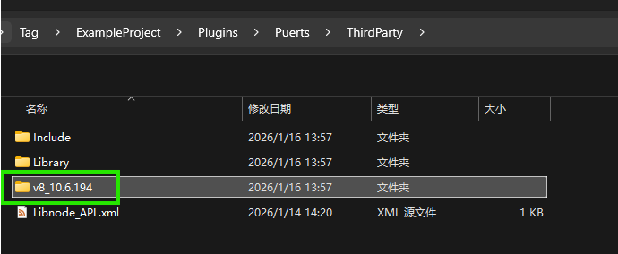
并且要修改JsEnv.Build.cs使其找到对应的V8路径：
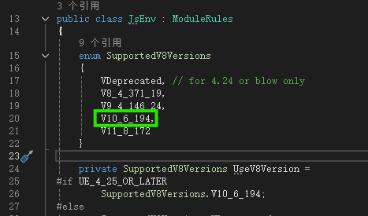
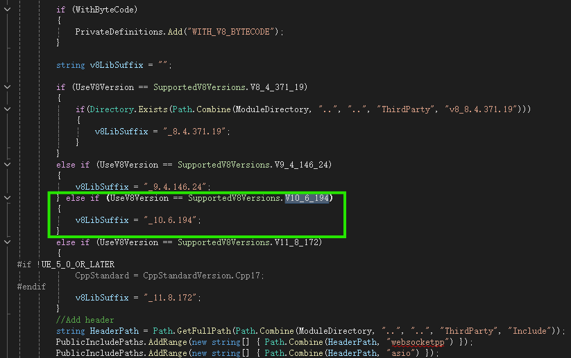

### 2.PuerTSTool编译
TSSubsystem.cpp中用到的一个GetJsEnv，需要在
\Plugins\Puerts\Source\Puerts\Private\PuertsModule.cpp 提供对应接口。
这样做的原因请看[这里](#reason-GetJsEnv)，这里先完成编译步骤：


PuertsModule.h:
```cpp
	//提供外部接口访问JsEnv
	virtual puerts::FJsEnv* GetJsEnv() = 0;
```

PuertsModule.cpp:
```cpp
	virtual puerts::FJsEnv* GetJsEnv()
	{
		return JsEnv.Get();
	}
```


编译成功后打开项目编辑器，点击GenDTS按钮，生成UE工程的类型给Typescript使用。实际上该按钮的作用是把整个工程的UObject类型都扫描一遍，然后把可以访问的UClass、UStruct、UEnum、UProperty和UFunction等信息都收集起来，生成ue.d.ts文件，.d.ts文件的作用相当于一个类库，用于编译生成js时对Typescript做类型校验。
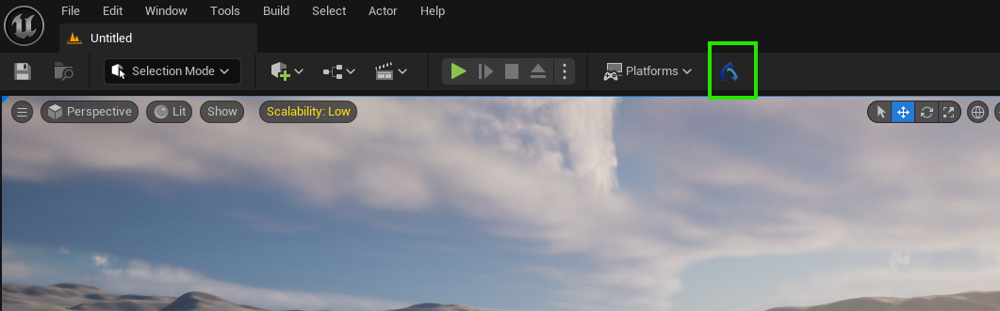


 ### TypeScript工程编译


PuerTSTool插件中有一个Package.json,复制到项目根目录执行
```shell
npm install
```


以下内容是不推荐的全局安装方式：
在安装了nodejs的情况下，全局安装typescript和ts-node
```sh
npm install -g typescript
npm install ts-node -g
```
查看版本，如果有输出则安装成功
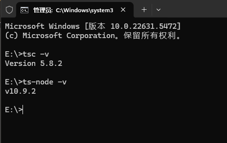

直接在项目根目录下打开cmd，输入
```sh
tsc -p tsconfig.json
```
如有报错解决即可。
#### 第一种方式：手动编译
```shell
node_modules\.bin\tsc -p tsconfig.json
```
或者监听，修改保存ts文件后自动编译：
```shell
node_modules\.bin\tsc -watch
```

#### 自动编译
TODO:


### 热刷
#### 第一种方式：在项目设置的Puerts中启用Puerts插件自带的编译脚本，通过V8虚拟机执行编译，并且在UE编辑器运行期间会对Typescript目录进行监听，一旦有文件修改便会自动进行编译。如下图所示：
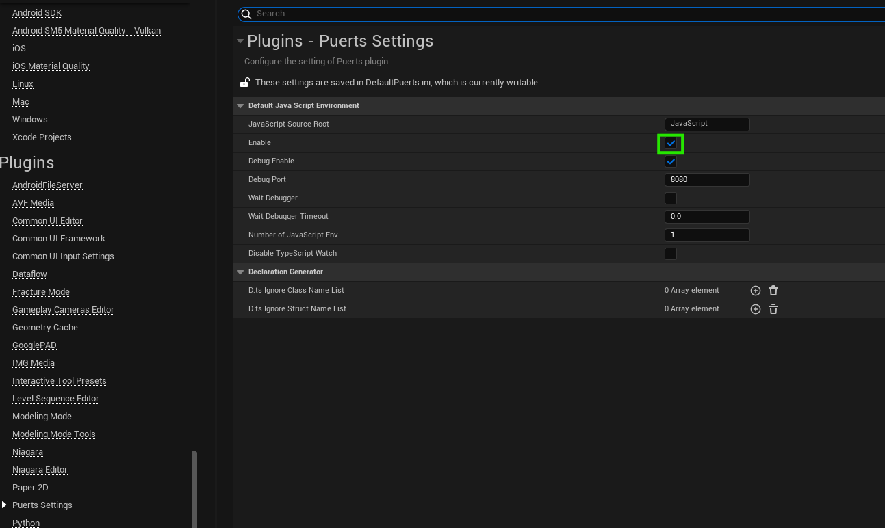

启动自动编译后，工程目录会多出一个ts_file_versions_info.json，该文件用于记录.ts文件的md5进行对比，不一样则触发编译。
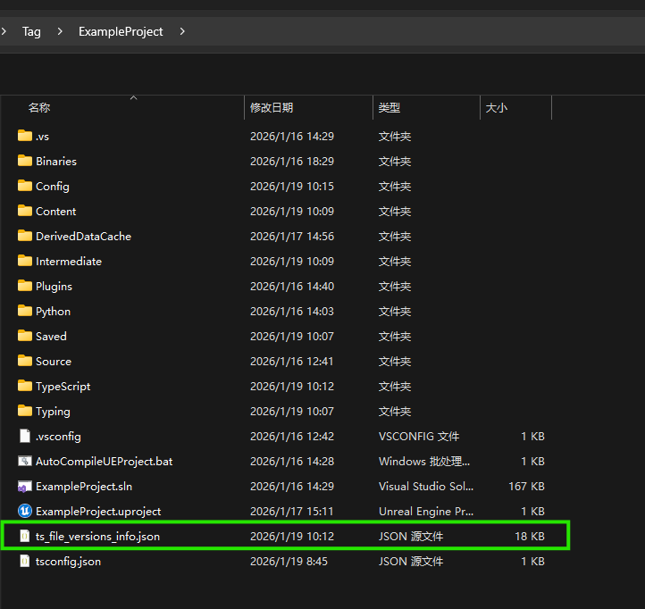

***注意：自动编译必须要保持项目编辑器正在运行才会执行，启动编辑器时也会diff一遍文件的MD5码进行编译。***

<a id="reason-GetJsEnv"></a>
<details> <summary>不自行new JsEnv的原因</summary>

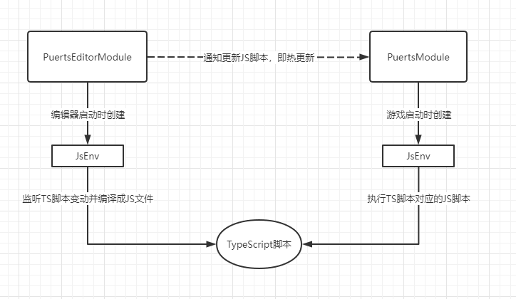
开启了Puerts自动编译，PuertsEditorModule会在编辑器启动时创建一个JsEnv用来监听TS文件变化并自动编译。游戏启动时PuertsModule也会自动创建一个JsEnv作为游戏运行时的脚本环境，并且PuertsEditorModule所创建的JsEnv监听到TS文件变化会通知PuertsModule所在的JsEnv刷新模块完成热刷新。两个模块的关系是一一对应的，所以尽量不要在外部自己new JsEnv（否则会失去热刷功能）。但由于Puerts插件默认的PuertsModule不向外提供JsEnv的访问接口，所以这里需要自行修改。

</details>


***注意！JS热刷只能热刷部分代码片段，例如函数体，已经new出来的部分成员属性是没法热更的！开启热刷的时候无法断点调试，这是为了防止热刷代码调试定位错误而强制二选一的，自己按需开启。***


#### 第二种方式：使用命令热刷TS（应该没什么必要用）
可参考https://github.com/puerts/v8-hot-reload-kit


### 3.项目设置
打包的时候需要把JavaScript目录包含进去，非.uasset文件在UE编辑器里面都是不可见的，所以无法在编辑器里面直接添加文件引用，只能把整个JavaScript目录直接包含在打包里面，如下图所示：

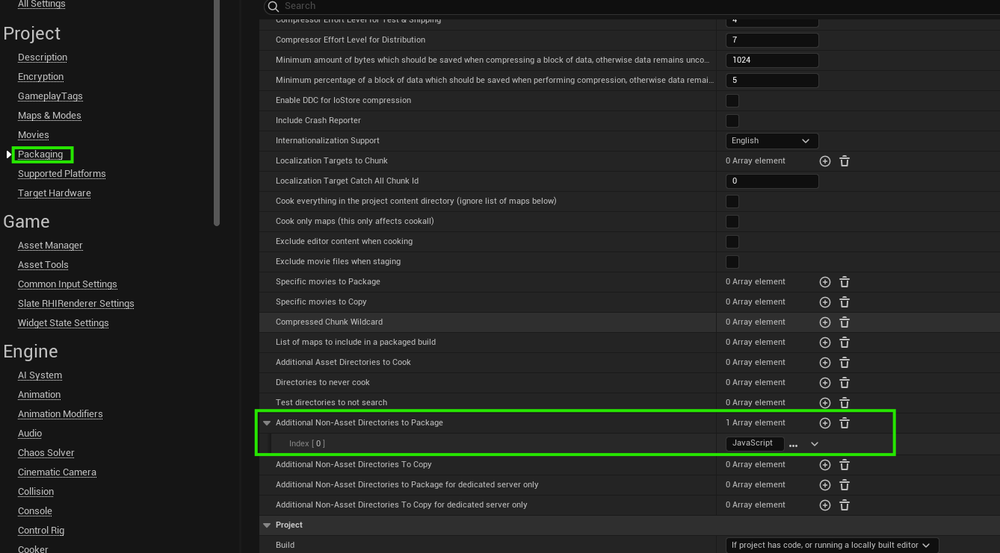


### 4.TypeScript附带框架 and PuerTSTool
PuerTSTool扩展了一些常用功能，支持：

* 打开引擎自动部署TypeScript代码到项目根目录
* 右键或在蓝图编辑器点击生成TS脚本，自动生成对应TypeScirpt文件，并自动往PreMixin.ts添加import
* 生成TypeScirpt文件后或已经生成再次点击上述按钮，可打开代码编辑器

#### 自动mixin的链路
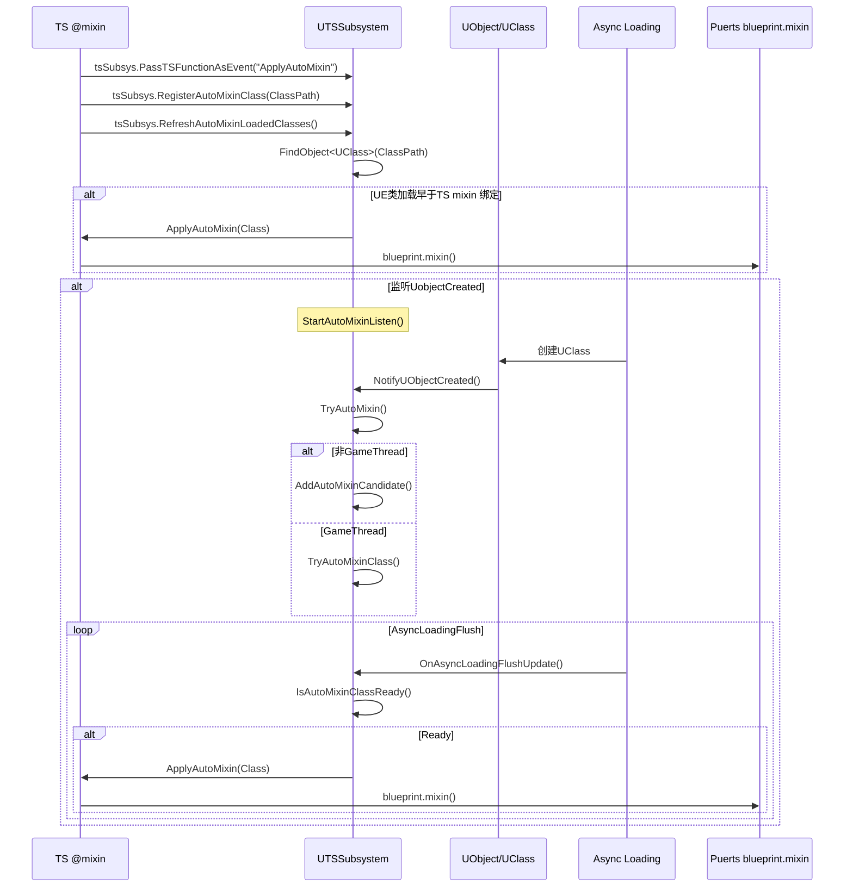
```mermaid
sequenceDiagram

participant TS as TS @mixin
participant Sub as UTSSubsystem
participant UObject as UObject/UClass
participant UE as Async Loading
participant Puer as Puerts blueprint.mixin

TS->>Sub: tsSubsys.PassTSFunctionAsEvent("ApplyAutoMixin")

TS->>Sub: tsSubsys.RegisterAutoMixinClass(ClassPath)

TS->>Sub: tsSubsys.RefreshAutoMixinLoadedClasses()

Sub->>Sub: FindObject<UClass>(ClassPath)

alt UE类加载早于TS mixin 绑定
    Sub->>TS: ApplyAutoMixin(Class)
    TS->>Puer: blueprint.mixin()
end

alt 监听UobjectCreated
    Note over Sub: StartAutoMixinListen()

    UE->>UObject: 创建UClass

    UObject->>Sub: NotifyUObjectCreated()

    Sub->>Sub: TryAutoMixin()

    alt 非GameThread
        Sub->>Sub: AddAutoMixinCandidate()
    else GameThread
        Sub->>Sub: TryAutoMixinClass()
    end

    loop AsyncLoadingFlush
        UE->>Sub: OnAsyncLoadingFlushUpdate()

        Sub->>Sub: IsAutoMixinClassReady()

        alt Ready
            Sub->>TS: ApplyAutoMixin(Class)
            TS->>Puer: blueprint.mixin()
        end
    end
end
```


#### QuickStart.ts
入口，且与TSSubSystem连接，一般不需要修改

#### PreMixin.ts
这里填需要Mixin的ts文件，如
```typescript
import "./Blueprints/BP_PlayerController";
```

#### G_App.ts
初始化模块函数中，填入Module文件夹中的对应Module，Module的写法可以参考TestModule.ts
```ts
    //初始化模块
    private InitModule(): void {
        //所有TS模块放在这里初始化
        let arrModuleClass = [
            // TestModule,
        ];

        for (let i = 0; i < arrModuleClass.length; i++) {
            ModuleManager.GetInstance().RegisterModule(arrModuleClass[i].name, new arrModuleClass[i]());
        }
        ModuleManager.GetInstance().Initialize();
    }
```

#### EventDefine.ts
用于添加时间定义，如游戏开始，游戏结束等。

#### 

</details>

### 5.调试（VSCode调试在下文）
每次启动JsEnv，输出日志框都会打印一个V8虚拟机的调试地址，只要用Chrome浏览器打开该地址就可以直接断点调试TS脚本。如果调试器里面没有显示Typescript目录的脚本，那有可能是你连接的地址并不是你想要调试的JsEnv，可以在设置里面指定一个新的端口，然后再重新连接该端口地址。
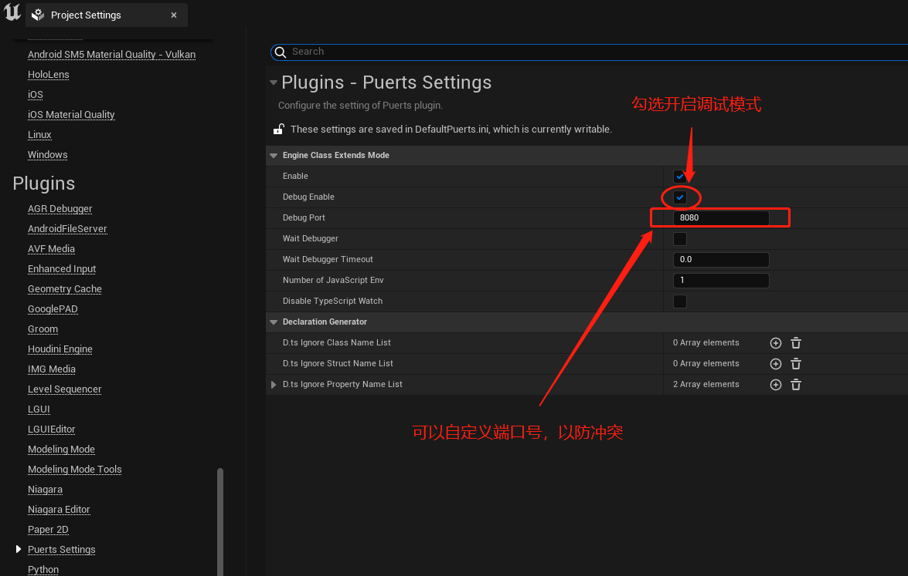
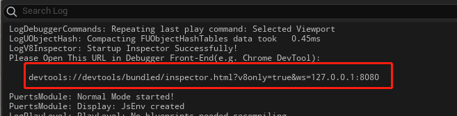
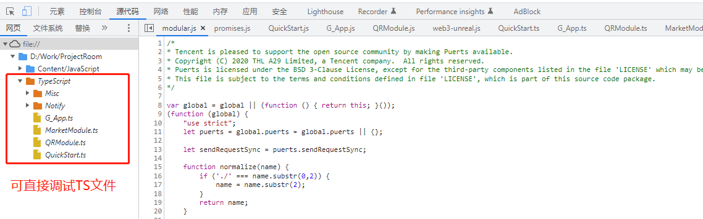


### 6.VSCode配合使用

#### 工作区搭建：

首先先新建工作区并保存：


编写settings.json，排除不用的文件和文件夹：

```json
{
    "search.exclude": {
        "**/node_modules": true,
        "**/bower_components": true,
     },
     "files.exclude": {
        "**/.git": true,
        "**/.svn": true,
        "**/.vs": true,
        "**/Binaries": true,
        "**/Config": true, 
        "**/Content": true,
        "**/DerivedDataCache": true,
        "**/Intermediate": true,
        "**/Plugins": true,
        "**/Saved": true,
        "**/Build": true,

        "**/.vsconfig": true,
        "**/*.uproject": true,
        "**/*.sln": true,

        "**/*.bat": true,
        "**/Python": true,
        "**/Source": true,

        "**/tsconfig.json" : true,
        "**/ts_file_versions_info.json" : true,
    }
}
```

#### 调试：

* JavaScript and TypeScript Nightly
* JavaScript Debugger (Nightly)
* nodejs

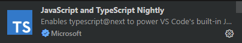

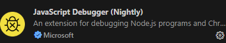

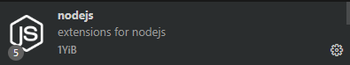

配置debug环境：

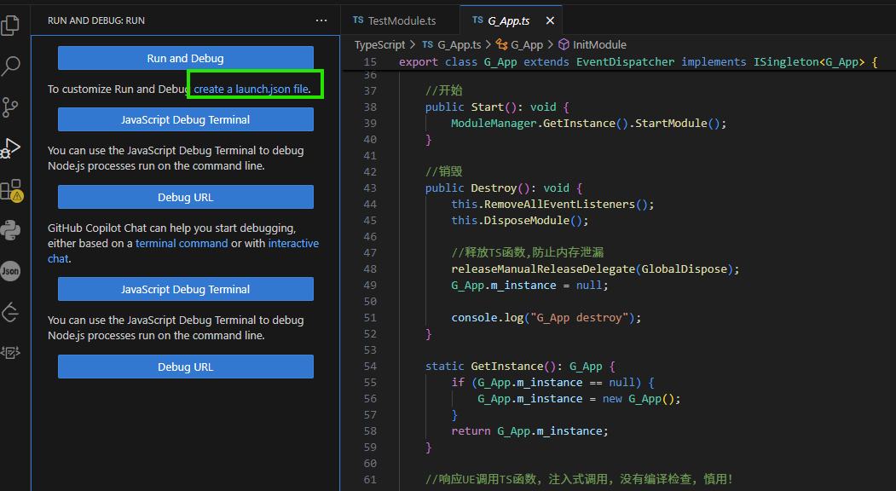
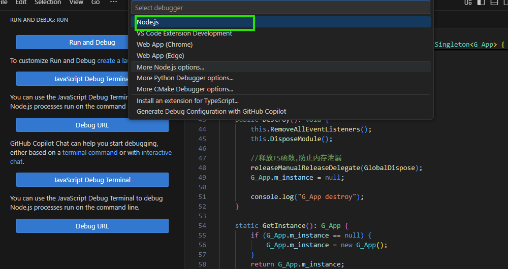
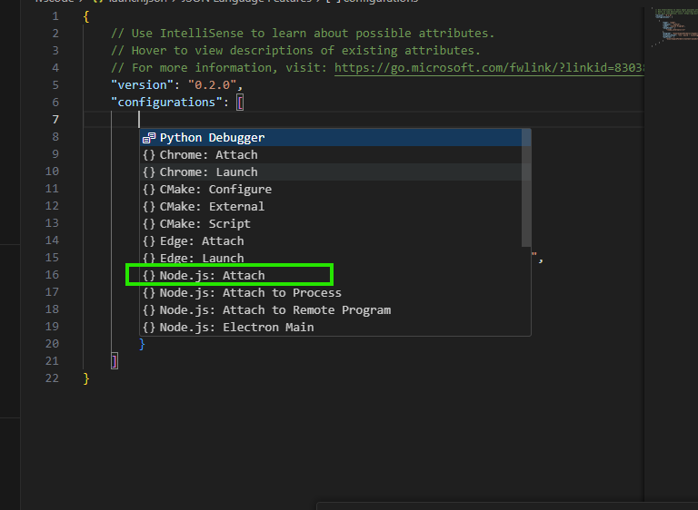

launch.json生成如下,注意端口号要匹配且不能被其他进程占用:
```json
{
    "version": "0.2.0",
    "configurations": [
        {
            "name": "Attach",
            "port": 8080, //对应端口号
            "request": "attach",
            "skipFiles": [
                "<node_internals>/**"
            ],
            "type": "node"
        },
    ]
}

```
启动调试即可进行断点
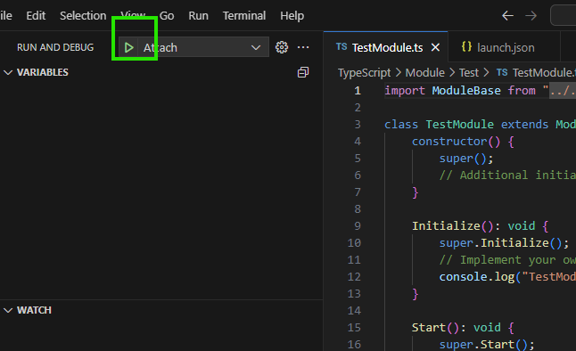
可以开启wait debugger，如果开启，则卡住进程来等待调试器连接。适合调试游戏开始前/开始时的逻辑。
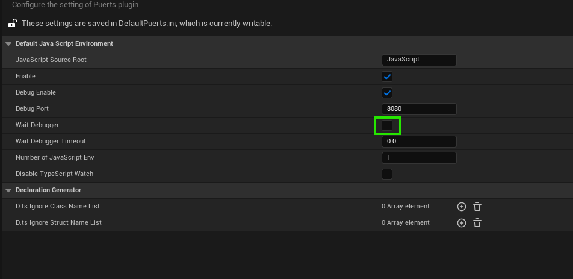

#### 附:Rider 配合使用
直接往项目添加现有文件夹，选择项目根目录的TypeScript文件夹即可

可能会出现无法调试的情况，需要使用webstrom (暂未尝试)
#### AI编程
可以先用Copilot 免费量大管饱：

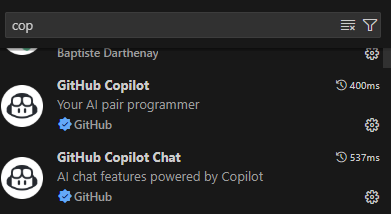

~~施工中......暂不提供全套AI效率工具~~

### 注意事项

#### 传递函数的时候要用闭包的方式，否则无法访问this对象，这个涉及到javascript的访问域问题，总结来说就是在代码块内部无法访问外部对象，需要把外部对象作为代码块变量传递进去。
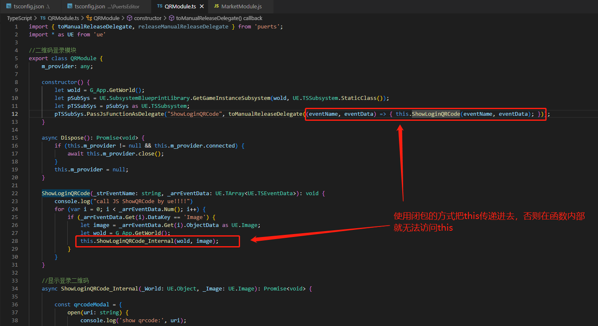

#### 导出模块互相访问需要把模块导入按顺序摆放，这个有点类似于C++的头文件include，但C++添加了pragma once宏可以防止重复导入，typescript只能手动管理，例如A导入B，B又导入A，如果A先执行，那B中的导入就必须放在代码定义的后面，如下图所示：
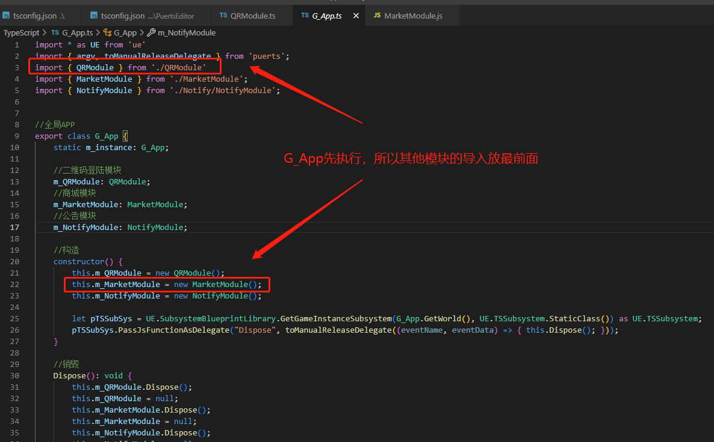
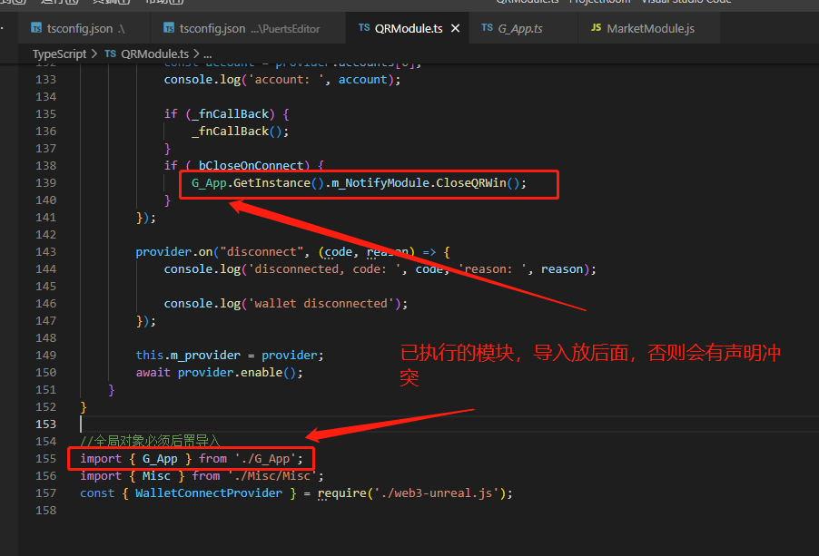

#### ts声明模块导入用import，js声明模块用require，虽然编译出来都是require，但语法规范还是不一样的。

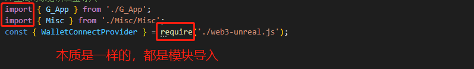


#### 修改了暴露给TS使用的蓝图或C++一定要按导出按钮重新导出ue.d.ts，否则属性或方法会不同步导致调用错误。
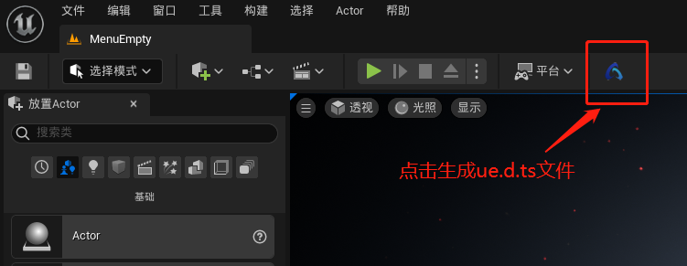


#### Typescript中int64的写法如下：


#### puerts中UE数组的写法如下：


#### puerts中获取结构体引用的写法如下：


#### puerts中变量声明时如果直接赋值实例，可以省略冒号类型声明，这样变量类型也是自动识别的：


#### 派生结构体在puerts中只支持向上转换，不支持向下转换。